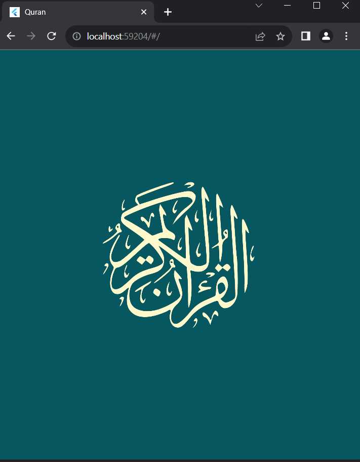
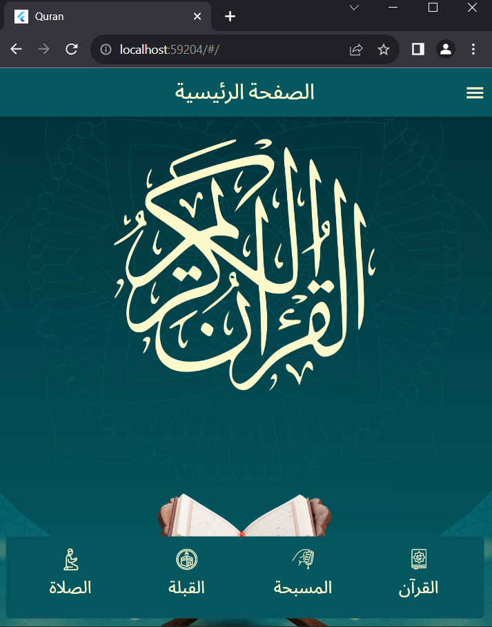
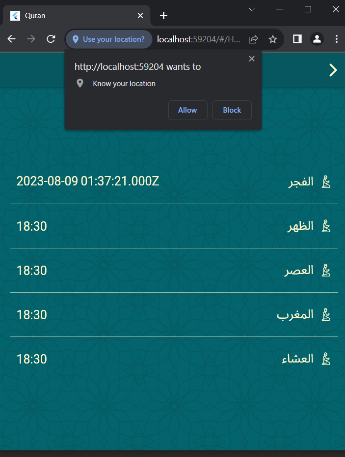
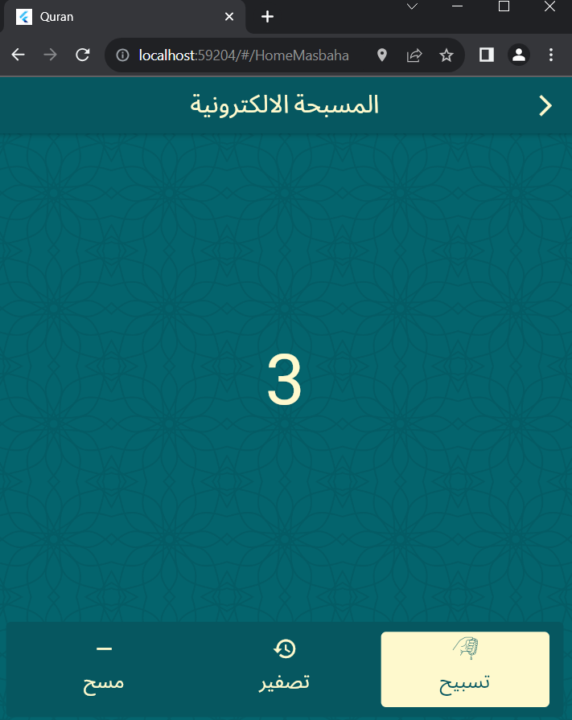
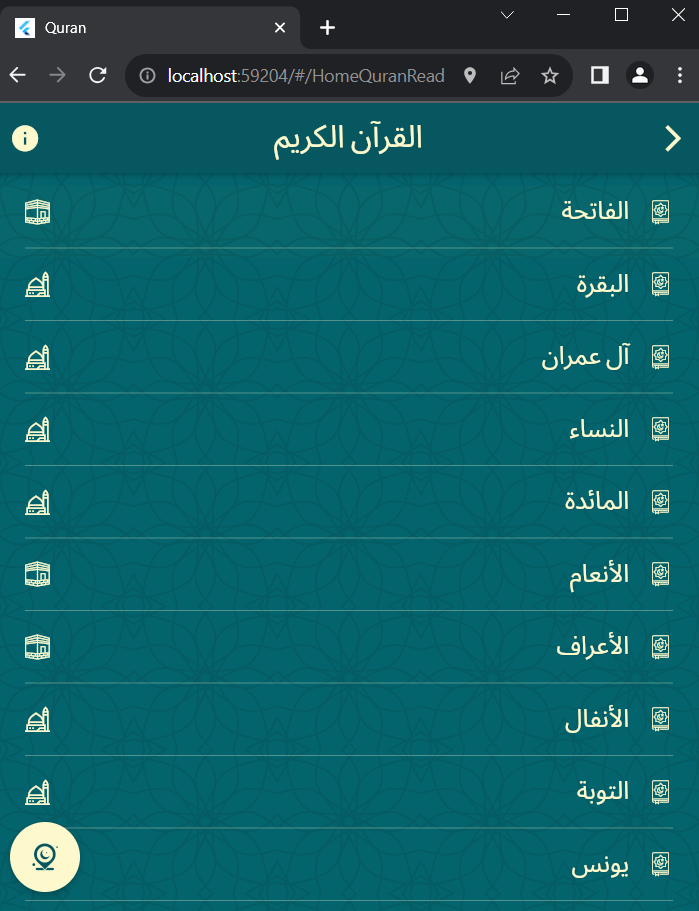
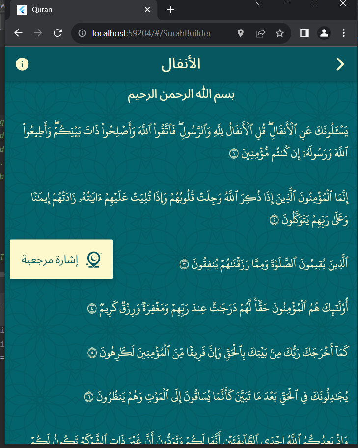

# IslamicCompanionApp

IslamicCompanionApp is an application designed for Muslims, providing a range of features to enhance their spiritual practices and daily routines. The app includes the complete Quran with the ability to set bookmarks, helping users easily resume their recitation from where they left off. It also includes features such as Qibla direction, prayer times, and a tasbeeh (prayer beads) counter.

## Table of Contents
- [Introduction](#introduction)
- [Features](#features)
- [Usage](#usage)
- [Installation](#installation)
- [Contributing](#contributing)
- [Contact](#contact)
- [Some Screenshots](#screenshots)
- [License](#license)

## Introduction
IslamicCompanionApp serves as a comprehensive tool for Muslims to enhance their connection with their faith and daily practices. It offers a collection of features aimed at facilitating spiritual activities and rituals.

## Features
- Complete Quranic text for recitation.
- Ability to set bookmarks at any verse to continue recitation later.
- Qibla direction indicator to locate the direction of the Kaaba.
- Accurate prayer times based on the user's location.
- Tasbeeh counter for reciting praises and remembrance of Allah.

## Usage
To use IslamicCompanionApp, follow these steps:
1. Open the app and explore the available features on the main screen.
2. Navigate to the Quran section to start reading or set bookmarks.
3. Use the Qibla indicator to determine the direction of the Kaaba.
4. Check the prayer times section to know the accurate times for prayers.
5. Utilize the tasbeeh counter to keep track of your praises and remembrance.

## Installation
1. Download and install IslamicCompanionApp from the respective app store.
2. Open the app and grant location permission for accurate prayer times.
3. Explore the features and customize settings as desired.

## Contributing
Contributions are welcome! If you'd like to contribute to IslamicCompanionApp, please follow these steps:
1. Fork the repository.
2. Create a new branch for your feature or improvement.
3. Make your changes and test thoroughly.
4. Submit a pull request detailing your changes.

## Contact
For inquiries or suggestions, you can reach out to me through my [Facebook](https://www.facebook.com/mostafa.atta.9085) or [LinkedIn](https://www.linkedin.com/in/mostafa-3tta-5949581a2/) profiles.

## screenshots
 

 

 

 
 

 
 

 
 

 
 

 

## License
This project is licensed under the [MIT License](LICENSE).
